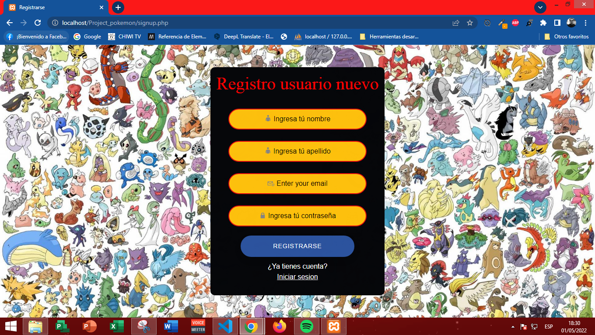

## Project Api Pokemons 
En este proyecto podemos ver 20 pokemones cada uno con su imagen y habilidades, el usuario podrá ver los 20 pokemones al crear una cuenta de usuario, una vez logeado basta con hacer click en algún pokemon para poder verlo, el proyecto también es responsive para comodidad del usuario. 

In this project we can see 20 pokemon each with its image and skills, the user can see the 20 pokemon by creating a user account, once logged in just click on any pokemon to see it, the project is also responsive for user convenience.
## API Reference

#### Get all items

```http
  GET //pokeapi.co/api/v2/pokemon/
```

| Parameter | Type     | Description                |
| :-------- | :------- | :------------------------- |
| `api_key` | `string` | **Required**. Your API key |

#### Get item

```http
  GET //pokeapi.co/api/v2/pokemon/${id}/
```

| Parameter | Type     | Description                       |
| :-------- | :------- | :-------------------------------- |
| `id`      | `string` | **Required**. Id of item to fetch |

Consume la API (20 pokemons) y muestra sus habilidades y una imagen del mismo.

It consumes the Api (20 pokemon) and displays their skills and an image of the pokemon.
## Caracteristicas

- Responsive
- Funciones dinámicas (botones, animaciones, iconos)
- Modo de pantalla completa
- Sistema de login y registro de usuarios.

## Features
- Responsive
- Dynamic functions (buttons, animations, icons)
- Full screen mode
- User login and signup system.

## Authors

- [@Dilson24](https://www.github.com/Dilson24)

## Screenshots
### Home


### Login


### App


## Tech
- [JavaScript] -  Interpreted programming language.
- [HTML5] - HyperText Markup Language, versión 5.
- [CSS] - Cascading Style Sheets.
- [SweetAlert] - *jQuery* plugin and with which we can give a professional look to the messages we send to users according to current trends.
- [Animate.css] - Library of ready-to-use, cross-browser animations for use in your web projects. Great for emphasis, home pages, sliders, and attention-guiding hints.
- [PHP] - General-purpose programming language that is especially suited to web development.
- [MySQL] - Relational database management system.
- [Bootstrap] - Cross-platform library or open source toolkit for web site and application design.
- [ApiPokemon] - This is a full RESTful API linked to an extensive database detailing everything about the *Pokémon* main game series.

## License
**Free Software, Hell Yeah!**
[MIT](https://choosealicense.com/licenses/mit/) © 2022 - Dilson Alexander Cruz Nivia

 [JavaScript]: <https://lenguajejs.com/>
 [HTML5]: <https://lenguajehtml.com/html/>
 [CSS]: <https://lenguajecss.com/css/>
 [SweetAlert]: <https://sweetalert.js.org/>
 [Animate.css]: <https://animate.style/>
 [Bootstrap]: <https://getbootstrap.com/>
 [PHP]: <https://www.php.net/>
 [MySQL]: <https://www.mysql.com/>
 [ApiPokemon]: <https://pokeapi.co/>